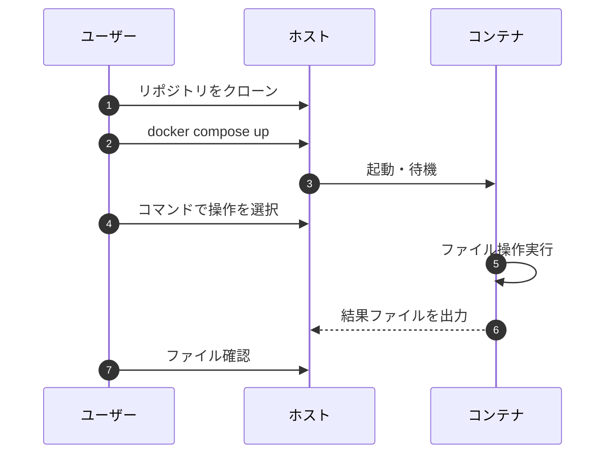

# File Manipulator System


### コマンドでファイル操作ができるシステム


<br>

## ⭐ デモ画像


### ファイル操作 (逆順で書き出し) を行うデモ画像

<br>


<br>

## **📝 サービス紹介と導入ガイド**
- [サービスの特徴・開発の目的](#サービスの特徴・開発の目的)

- [セットアップ手順](#セットアップ手順)

- [基本的な使い方](#基本的な使い方)

<br>

## **🛠 技術構成**

- [システム全体の構成図](#システム全体の構成図)

- [使用技術](#使用技術)


<br>

## **📚 出典・ライセンス**

- [参考文献](#参考文献)

- [ライセンス情報](#ライセンス)

<br>

---

## <a id="サービスの特徴・開発の目的"></a> 📝 サービスの特徴・開発の目的

<br>

###  サービスの全体像

- このプロジェクトは、**ファイル操作を簡単に行えるシステム**です。

- `docker compose up` でコンテナを立ち上げ、`docker compose exec` で任意のファイル操作を行います。


<br>

### できること

- **reverse**  
  
  ファイルの中身を逆順にして指定ファイルへ出力します。 

- **copy**  
  
  ファイルのコピーを作成します。

- **duplicate-contents**  
  
  ファイルの内容を指定回数複製して上書き保存します。

- **replace-string**

  ファイル内の特定文字列を別の文字列に置換して上書き保存します。

<br>

### 作成のきっかけ

1. **課題意識**

   手作業でのファイル加工（逆順化・コピー・複製・文字列置換）はミスが発生しやすい

2. **解決アプローチ**

   Pythonでファイルの「逆順化」「コピー」「複製」「文字列置換」をそれぞれメソッド化し、コマンドから簡単に使えるようにした

3. **得られた学び**

   ファイル操作システムをスクラッチで実装し、データの読み込みから書き出しまでの内部処理を深く理解した


<br>


---

## <a id="セットアップ手順"></a> 🚀 セットアップ手順

<br>

### 1. 前提条件 

以下を事前にインストールしてください

- [Git](https://git-scm.com/)

- [Docker](https://docs.docker.com/get-docker/)

<br>

### 2. リポジトリのクローン

以下のコマンドをターミナルで実行します

```bash
git clone git@github.com:BackendExplorer/File-Manipulator-System.git
```

```bash
cd File-Manipulator-System
```

<br>

---


## <a id="基本的な使い方"></a>🧑‍💻 基本的な使い方

<br>

### 1. コンテナ起動

Docker Desktopを起動したら、ターミナルを開いて、以下のコマンドでコンテナを起動します。


```bash
docker compose up
```

<br>

### 2. ユーザーの操作手順

<br>


#####  逆順にして書き出し
```bash
docker compose exec app python file_manipulator.py reverse input.txt output_reverse.txt
```
| コマンド              | 内容                                                        |
| --------------------- | ----------------------------------------------------------- |
| `input.txt`           | 処理対象のファイルのパス（ディレクトリ＋ファイル名）        |
| `output_reverse.txt`  | 逆順にした内容を書き込むファイルのパス（ディレクトリ＋ファイル名） |

<br>

#####  コピー
```bash
docker compose exec app python file_manipulator.py copy input.txt output_copy.txt
```
| コマンド             | 内容                                                        |
| -------------------- | ----------------------------------------------------------- |
| `input.txt`          | コピー元のファイルのパス（ディレクトリ＋ファイル名）        |
| `output_copy.txt`    | コピー先のファイルのパス（ディレクトリ＋ファイル名）        |

<br>

#####  内容を3回複製して上書き
```bash
docker compose exec app python file_manipulator.py duplicate-contents input.txt _dummy 3
```
| コマンド     | 内容                                                        |
| ------------ | ----------------------------------------------------------- |
| `input.txt`  | 複製対象のファイルのパス（ディレクトリ＋ファイル名）        |
| `dummy`     | 出力パスは使用しないためダミーを指定                        |
| `3`          | ファイルの内容を複製する回数                                |

<br>

#####  文字列置換して上書き
```bash
docker compose exec app python file_manipulator.py replace-string input.txt dummy "こんにちは！" "こんばんは！"
```
| コマンド     | 内容                                                        |
| ------------ | ----------------------------------------------------------- |
| `input.txt`  | 置換対象のファイルのパス（ディレクトリ＋ファイル名）        |
| `dummy`     | 出力パスは使用しないためダミーを指定                        |
| `"こんにちは！"`      | 置換前の文字列                                              |
| `"こんばんは！"`      | 置換後の文字列                                              |

<br>

---


## <a id="システム全体の構成図"></a>🔄 システム全体の構成図

<br>



<br>


<br>

---

## <a id="使用技術"></a>🧰 使用技術

<br>

### 技術選定の理由

- **`Python`**
  
  豊富な標準ライブラリと高い可読性によって、複雑なシステムを効率的に実装するため
  

- **`Docker`**

  依存関係をコンテナ内に隔離し、環境差異を排除してどこでも同じ動作を保証するため

- **`Docker-Compose`**

  サーバコンテナとクライアントコンテナを同時に起動し、起動手順を簡素化するため

<br>

| カテゴリ       | 技術スタック                                                                 |
|----------------|------------------------------------------------------------------------------|
| 開発言語       |  |
| 開発環境       | &nbsp;&nbsp;&nbsp;&nbsp; |
| バージョン管理 | &nbsp;&nbsp;&nbsp;&nbsp; |
| インフラ |   |
| 描画ツール     | &nbsp;&nbsp;&nbsp;&nbsp; |

<br>

---

## <a id="参考文献"></a>📗 参考文献

<br>

### 公式ドキュメント

- [Python 公式ドキュメント](https://docs.python.org/3/)
  
  標準ライブラリの利用方法を参照

- [Docker - コンテナ](https://docs.docker.com/)

  コンテナのビルドと実行手順を参照

- [Docker Compose - サービス定義](https://docs.docker.com/compose/)

  コンテナの起動方法を参照

<br>

---

## <a id="ライセンス"></a>📜 ライセンス情報

<br>

<ul>
  <li>
    本プロジェクトの全コード・構成・図・UIなどの著作権は、制作者である Tenshin Noji に帰属します。<br><br>
    採用選考や個人的な学習を目的とした閲覧・参照は歓迎しますが、<br><br>
    無断転載・複製・商用利用・二次配布は禁止とさせていただきます。<br><br>
    ライセンス全文はリポジトリ内の <a href="./LICENSE.md" target="_blank">LICENSEファイル</a>をご覧ください。
  </li>
</ul>

<br>